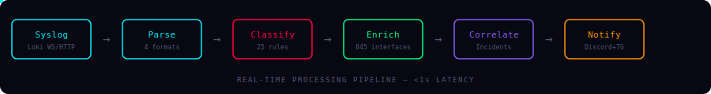
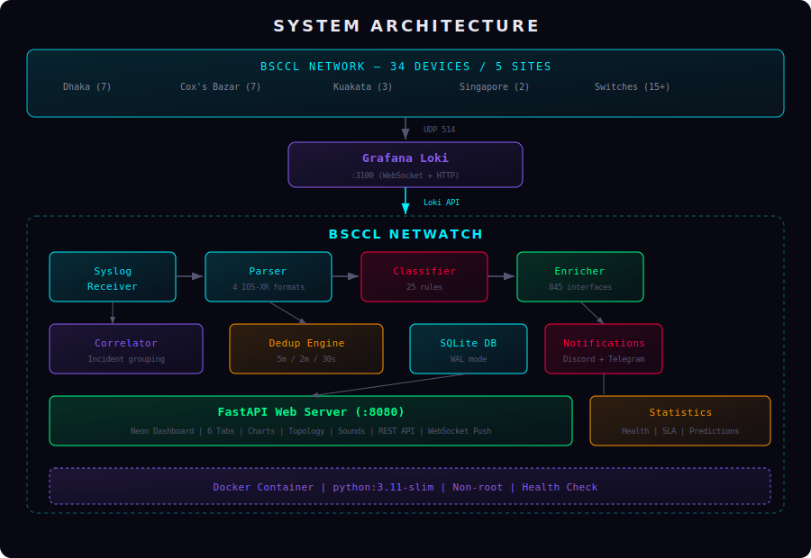
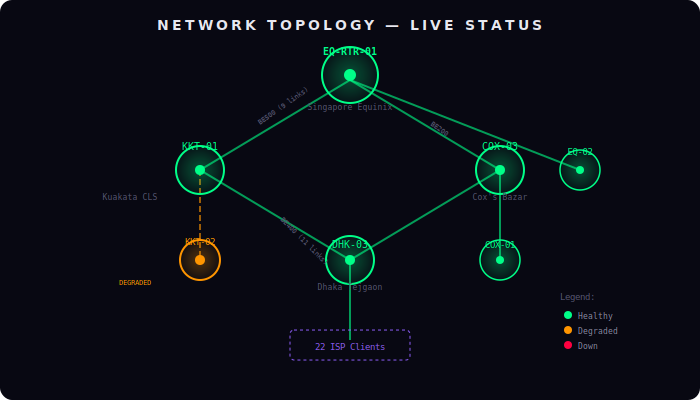

<p align="center">
  
</p>

<p align="center">
  <strong>Mission-Critical Network Operations Center Dashboard</strong><br/>
  <em>Real-time syslog classification, alerting, and incident correlation for Bangladesh's submarine cable backbone</em>
</p>

<p align="center">
  
  
  
  
  
</p>

<p align="center">
  
  
  
  
  
</p>

---

## What is this?

BSCPLC (Bangladesh Submarine Cables PLC) operates a multi-site ISP/carrier backbone spanning **5 locations across 2 countries** — from Dhaka and Cox's Bazar in Bangladesh to Singapore's Equinix data center. Their existing Grafana syslog dashboard shows thousands of raw, unclassified log lines, making it impossible to distinguish a critical fiber cut from routine noise.

**NetWatch** replaces that chaos with an intelligent, real-time alert classification system that:

- **Parses** 4 distinct Cisco IOS-XR syslog formats from 34 network devices
- **Classifies** every log into 5 severity tiers using 26 regex rules
- **Enriches** each alert with device identity, interface descriptions, client names, and AS numbers from 845+ interface mappings
- **Correlates** cascading failures — a single fiber cut generating 200+ alerts becomes **one incident**
- **Notifies** operators via Discord and Telegram with deduplication and flap detection
- **Displays** everything in a futuristic neon-themed dashboard optimized for 55" 4K NOC wall TVs, with live topology, charts, and sound alerts
- **Auto-resolves** incidents when recovery events arrive (Interface Up, Bundle Active, BGP Up) — only genuinely unresolved faults remain

<p align="center">
  
</p>

---

## Architecture

<p align="center">
  
</p>

### Processing Pipeline

```
Syslog (UDP 514) → Grafana Loki → WebSocket Tail → NetWatch Pipeline
                                                        │
                    ┌───────────────────────────────────┘
                    │
              ┌─────▼──────┐     ┌──────────┐     ┌──────────┐
              │   Parser    │────▶│Classifier│────▶│ Enricher │
              │ 4 IOS-XR   │     │ 26 rules │     │ 845 intf │
              │  formats    │     │ 121 AS   │     │ 33 devs  │
              └─────────────┘     └──────────┘     └────┬─────┘
                                                        │
              ┌─────────────┐     ┌──────────┐     ┌────▼─────┐
              │   Dedup     │◀────│Correlator│◀────│  Store   │
              │ 5m/2m/30s   │     │ Incidents│     │  SQLite  │
              └──────┬──────┘     └──────────┘     └──────────┘
                     │
        ┌────────────┼────────────┐
        ▼            ▼            ▼
   ┌─────────┐ ┌─────────┐ ┌──────────┐
   │ Discord │ │Telegram │ │Dashboard │
   │ Webhook │ │  Bot    │ │WebSocket │
   └─────────┘ └─────────┘ └──────────┘
```

---

## Network Topology

<p align="center">
  
</p>

The correlation engine uses the **network dependency tree** to automatically detect root causes. When `Bundle-Ether500` (the 9-link backhaul between Singapore and Kuakata) degrades, NetWatch:

1. Identifies the member link failure as **root cause**
2. Marks all subsequent BGP peer-down alerts as **symptoms**
3. Groups everything into a **single incident** (e.g. `INC-20260523-001`)
4. Suppresses 200+ redundant notifications
5. Lists all **affected clients** from the topology tree

---

## Key Numbers

| Metric | Value |
|--------|-------|
| Network devices monitored | **34** across 5 sites |
| Interface mappings | **845** with descriptions |
| BGP peers tracked | **294** (210 MLPE IX + 84 PNI/transit) |
| AS number database | **121** entries with names and types |
| Classification rules | **26** (14 CRITICAL, 3 WARNING, 6 INFO, 3 LOGIN) |
| Syslog formats parsed | **4** (IOS-XR +06, BDT, ADMIN, bare) |
| Dedup windows | **5 min** standard, **2 min** BGP flap, **30 sec** bundle |
| Test suite | **650 tests**, 96% coverage |

---

## Quick Start

### Prerequisites

- Python 3.11 or 3.12
- Access to Grafana Loki at `192.168.200.230:3100` (office) or `103.16.152.8:3100` (remote)

### Local Development

```bash
# Clone
git clone https://github.com/Muminur/Grafana-Loki-Netwatch-monitoring-notification-by-Mumin.git
cd Grafana-Loki-Netwatch-monitoring-notification-by-Mumin

# Setup
python -m venv .venv
source .venv/bin/activate  # or .venv\Scripts\activate on Windows
pip install -r requirements.txt -r requirements-dev.txt

# Configure
cp .env.example .env
# Edit .env with your Loki host, Discord webhook, Telegram token

# Run
uvicorn src.main:app --host 0.0.0.0 --port 8080 --reload

# Open http://localhost:8080
```

### Docker

```bash
# Build and run
docker-compose up -d

# Check health
curl http://localhost:8080/health
```

### Run Tests

```bash
# Full test suite
pytest -vv

# With coverage
coverage run -m pytest && coverage report

# Lint + type check
ruff check .
black --check .
mypy src/
```

---

## Configuration

All configuration is via environment variables (`.env` file):

```env
# Network access — choose your location
MONITOR_HOST=192.168.200.230    # BSCPLC office
# MONITOR_HOST=103.16.152.8    # Remote / home

# Notifications
DISCORD_WEBHOOK_URL=https://discord.com/api/webhooks/...
DISCORD_ENABLED=true
TELEGRAM_BOT_TOKEN=...
TELEGRAM_CHAT_ID=...
TELEGRAM_ENABLED=true

# Grafana
GRAFANA_API_KEY=...
GRAFANA_DASHBOARD_UID=8sWAY1LMz

# Dedup windows (seconds)
DEDUP_WINDOW_SECONDS=300
BGP_FLAP_WINDOW_SECONDS=120
BUNDLE_GROUP_WINDOW_SECONDS=30

# ASN organization lookup (BigDataCloud — cached in SQLite)
ASN_API_KEY=...
```

---

## Dashboard Features

### NOC Wall Display (55" 4K Optimized)
The dashboard is designed for deployment on a 55-inch 4K TV in the Network Operations Center:
- **Side-by-side layout** — Active Incidents (left 40%) + Alert Stream (right 60%)
- **4K typography scaling** — base font 14px → 24px at `@media (min-width: 2000px)` for distance reading
- **~49 visible alert rows** at 4K resolution, filling the full viewport height
- **CRITICAL tab** is the default view on page load
- **Chart.js font scaling** — legend/tooltip text adapts to viewport (10px desk → 16px 4K)
- Responsive collapse to single column below 1100px for desk/dev use

### Neon-Themed UI
Futuristic "Mission Control" design with:
- **Orbitron** display font for headers
- **JetBrains Mono** for data and numbers
- Glassmorphism cards with neon glow borders
- Pulsing red animation for CRITICAL alerts
- Dark void background (`#080812`)

### 6 Severity Tabs
| Tab | Color | Content |
|-----|-------|---------|
| CRITICAL | `#ff0040` (red glow) | BGP down/up, faults, SFP alarms, interface down/up, bundle active/expired |
| WARNING | `#ffdd00` (yellow) | BGP max-prefix reached, BER clear, SFP clear |
| INFO | `#00f0ff` (cyan) | Known noise, port creation failures, EEM scripts |
| NOISE | `#555570` (dim) | Repeated known issues, hidden by default |
| LOGIN | `#00ff88` (green) | SSH login/logout with session tracking |
| STATS | `#8b5cf6` (purple) | Health score, charts, SLA metrics |

### Active Incidents Panel
- **Rich titles** with shortened interface names and actionable context:
  - Bundle: `Bundle DOWN — KKT-Core-2, TGE0/0/1/7, BE201`
  - BGP: `ADJCHANGE — KKT-Core-3 DOWN - Orange S.A.`
  - Fault: `RXFault-KKT-Core-1 - TGE0/0/0/2 - Local Fault`
- **Auto-resolution** — DOWN incidents automatically clear when the interface/BGP recovers
- **Device-specific matching** — same interface name on different routers (connecting to different far-end equipment) is correctly treated as separate incidents
- **ASN organization names** — resolved via BigDataCloud API, cached in SQLite (never re-fetched)

### Live Features
- **Auto-reconnecting WebSocket** for real-time alert push
- **Deduplication enforced** — DB storage, WebSocket broadcast, and in-memory store all respect the 5-minute dedup window
- **Client-side dedup safety net** — 5-minute sliding-window check in the browser
- **Web Audio API** sound alerts (critical alarm, warning chime, recovery arpeggio)
- **Browser notifications** for CRITICAL events
- **Keyboard shortcuts** — `1-5` switch tabs, `A` acknowledge, `N` mute, `/` search
- **SVG network topology** with live device status colors

### Settings & Maintenance
- **Hardware Defects as Noise** toggle (Settings page, default ON) — classifies persistent
  hardware faults (`RX_FAULT` / `SIGNAL` / `RFI`) on backbone P2P bundle members as NOISE
  instead of CRITICAL, so a flapping optic doesn't drown the CRITICAL tab. Toggle off to treat
  them as CRITICAL again. Exposed via `GET`/`POST /api/settings/hardware-noise`.
- **Maintenance windows** — schedule planned-work windows per device (`/api/maintenance`);
  CRITICAL notifications for that device are suppressed for the window's duration.

### Charts (Chart.js)
- Alert timeline (stacked area, configurable range)
- Category donut (severity distribution)
- Top devices bar chart
- Network health gauge (0-100 score)
- Chart cell overflow capped at 4K viewports

---

## Classification Rules

<details>
<summary><strong>14 CRITICAL rules</strong> (trigger Discord + Telegram notifications)</summary>

| Rule | Pattern | Event |
|------|---------|-------|
| `BGP_DOWN` | `ADJCHANGE.*Down` | BGP peer went down |
| `LACP_EXPIRED` | `no longer Active` | Bundle member LACP expired |
| `REMOTE_FAULT` | `RX_FAULT.*Remote Fault` | Remote fault (DPA) |
| `LOCAL_FAULT` | `RX_FAULT.*Local Fault` | Local fault (DPA) |
| `RFI_FAULT` | `RFI.*Detected.*Fault` | Remote/local fault (RFI) |
| `SIGNAL_FAILURE` | `Signal failure` | Signal failure on interface |
| `SFP_ALARM_SET` | `LOW_RX_POWER_ALARM.*Set` | SFP optic failing |
| `DUPLICATE_IPV6` | `ADDRESS_DUPLICATE` | Duplicate IPv6 address |
| `INTF_DOWN` | `UPDOWN.*Down` | Interface went down |
| `LINEPROTO_DOWN` | `LINEPROTO.*Down` | Line protocol went down |
| `BGP_UP` | `ADJCHANGE.*Up` | BGP peer came up (recovery) |
| `INTF_UP` | `UPDOWN.*Up` | Interface came up (recovery) |
| `LINEPROTO_UP` | `LINEPROTO.*Up` | Line protocol came up (recovery) |
| `LACP_ACTIVE` | `BM-6-ACTIVE.*Active` | Bundle member became active (recovery) |
</details>

<details>
<summary><strong>3 WARNING rules</strong></summary>

`BGP_MAXPFX` (max prefix threshold), `BER_CLEAR`, `SFP_ALARM_CLEAR`
</details>

<details>
<summary><strong>6 INFO rules</strong></summary>

`PORT_CREATION_FAIL`, `OPERATION_STALLED`, `HW_EVENT_OK`, `EEM_COMMIT`, `EEM_SCRIPT`, `NSR_DISABLED`
</details>

<details>
<summary><strong>3 USER_LOGIN rules</strong></summary>

`SSH_LOGIN`, `SSH_LOGOUT`, `CONFIG_COMMIT_USER`
</details>

---

## Event Correlation

The correlation engine is what makes NetWatch genuinely useful in production. Without it, a single fiber cut generates 200+ alerts. With it:

```
WITHOUT CORRELATION:                    WITH CORRELATION:
─────────────────────                   ─────────────────
Alert: BE500 member TenGigE0/0/0/0 ↓   Incident: INC-20260523-001
Alert: BE500 member TenGigE0/0/0/1 ↓   Root: Bundle-Ether500 DEGRADED
Alert: BE500 member TenGigE0/0/0/2 ↓   Device: EQ-RTR-01 (Singapore)
Alert: BGP DOWN AS399077 TCLOUD         Affected: 3/9 members down
Alert: BGP DOWN AS24482 SG.GS          Suppressed: 47 symptom alerts
Alert: BGP DOWN AS714 Apple             Clients: KKT-01, DHK-03,
Alert: BGP DOWN AS8075 Microsoft          Skytel, ADN, Velocity,
Alert: BGP DOWN AS15169 Google             Novocom, Link3, ...
Alert: BGP DOWN AS32934 Facebook
... (200+ more alerts)                  1 notification (not 200+)
```

---

## Notification Dedup

| Strategy | Window | Trigger |
|----------|--------|---------|
| **Standard dedup** | 5 minutes | Same device + mnemonic + interface/neighbor |
| **BGP flap detection** | 2 minutes | Down → Up → Down pattern → single "FLAPPING" alert |
| **Bundle grouping** | 30 seconds | Multiple member events → grouped by parent bundle |
| **Incident auto-resolution** | Real-time | Recovery event (Up/Active/Clear) removes matching DOWN incident |
| **BGP-UP silent fault clear** | Real-time | BGP UP on backbone P2P bundle auto-resolves RX_FAULT/SIGNAL/RFI (IOS-XR never sends clears for these) |
| **Escalation** | 15 minutes | Unacknowledged CRITICAL → escalation channel |

Dedup is enforced at every layer: DB storage, WebSocket broadcast, and in-memory store all skip suppressed duplicates. Client-side dedup provides an additional safety net in the browser.

---

## Reliability & Security Hardening

Production-hardening applied across the stack:

- **HTTP security headers** on every response — `Content-Security-Policy`, `X-Frame-Options: DENY`, `X-Content-Type-Options: nosniff`. CORS origins are configurable via `CORS_ORIGINS`.
- **SSRF guard** — `MONITOR_HOST` is validated at startup (rejects URI schemes and malformed IP addresses).
- **Notification delivery** — Discord/Telegram sends retry with exponential backoff, honour HTTP 429 `Retry-After`, validate webhook/token format, and sanitise message fields; secrets are never written to logs.
- **Syslog ingest resilience** — Loki HTTP poll uses exponential backoff with a lag warning and page-boundary cursor de-duplication (no silent data loss); `health_status()` surfaces receiver state.
- **Input limits** — the parser caps line length (ReDoS/DoS guard); the API validates `severity`/`period` filters (HTTP 400) and bounds the in-memory maintenance store; the WebSocket manager caps connections and drops slow clients (backpressure).
- **Database** — `incident_id` and silent-fault-resolution indexes, an idempotent index migration, and connection pre-ping.
- **AS-cache** — tight timeout, bounded retry, timezone-correct TTL, and URL/key redaction in logs.
- **Supply chain & image** — CI runs `pip-audit`; the Docker image is pinned and non-root with a `.dockerignore`, resource limits, and `no-new-privileges`.

---

## API Reference

| Endpoint | Method | Description |
|----------|--------|-------------|
| `/health` | GET | Health check — uptime, alert count, and live DB connectivity (`database_ok`; `status: degraded` when the DB check fails) |
| `/api/alerts` | GET | Paginated alerts with severity/device/time filters |
| `/api/alerts/count` | GET | Alert counts by classification for a period |
| `/api/alerts/{id}` | GET | Single alert details |
| `/api/incidents` | GET | Active incidents |
| `/api/incidents/{id}` | GET | Incident details with symptom list |
| `/api/incidents/{id}/acknowledge` | POST | Acknowledge an incident |
| `/api/stats/daily` | GET | Today's alert statistics |
| `/api/stats/weekly` | GET | 7-day statistics |
| `/api/stats/monthly` | GET | 30-day statistics |
| `/api/stats/yearly` | GET | 12-month statistics |
| `/api/settings/hardware-noise` | GET / POST | Read or toggle "Hardware Defects as Noise" |
| `/api/maintenance` | GET / POST | List or create maintenance windows |
| `/api/maintenance/{id}` | DELETE | Delete a maintenance window |
| `/api/devices` | GET | All 34 devices with status |
| `/api/topology` | GET | Network topology (nodes + links) |
| `/api/bgp/peers` | GET | BGP peer status |
| `/ws` | WS | Live alert stream (all classifications) |
| `/ws/filtered` | WS | Filtered alert stream (subscribe per severity) |

---

## Statistics & SLA

### Network Health Score (0-100)

| Factor | Impact |
|--------|--------|
| Active CRITICAL alert | -5 points each |
| Active WARNING alert | -1 point each |
| Active incident | -10 points each |
| Flapping BGP peer | -3 points each |
| No criticals in last hour | +5 bonus |
| All 34 devices reporting | +5 bonus |

### Client SLA Tracking
Per-client metrics: **uptime %**, **MTBF** (hours), **MTTR** (minutes), **incident count** over configurable periods.

### BGP Prefix Prediction
Monitors prefix counts against configured maximums. Warns at **80%** and **90%** thresholds with estimated days until exhaustion.

---

## Project Structure

```
bsccl-netwatch/
├── src/
│   ├── main.py                    # FastAPI app + lifespan
│   ├── config.py                  # Settings from .env
│   ├── core/
│   │   ├── parser.py              # 4-format IOS-XR syslog parser
│   │   ├── classifier.py          # 26-rule classification engine
│   │   ├── enricher.py            # Device/interface/AS enrichment
│   │   ├── correlator.py          # Event correlation + incidents
│   │   ├── dedup.py               # Notification deduplication
│   │   └── syslog_receiver.py     # Loki WS/HTTP/UDP ingestion
│   ├── data/
│   │   ├── device_map.py          # 33 devices → IP/name/location
│   │   ├── interface_map.py       # 845 interfaces → description
│   │   ├── as_database.py         # 121 AS numbers → name/type
│   │   ├── classification_rules.py # 26 compiled regex rules
│   │   └── topology.py            # Network dependency tree
│   ├── database/
│   │   ├── models.py              # 7 SQLAlchemy models
│   │   ├── crud.py                # DB operations
│   │   ├── migrations.py          # Auto table creation + WAL
│   │   └── as_cache.py            # External AS lookup cache + BigDataCloud API
│   ├── notifications/
│   │   ├── discord.py             # Discord webhook sender
│   │   ├── telegram.py            # Telegram bot sender
│   │   ├── formatter.py           # Message formatting
│   │   ├── escalation.py          # 15-min escalation pipeline
│   │   └── digest.py              # Daily summary generator
│   ├── statistics/
│   │   ├── engine.py              # Stats queries
│   │   ├── aggregator.py          # Hourly aggregation
│   │   ├── health_score.py        # Network health 0-100
│   │   ├── sla.py                 # Client SLA tracking
│   │   └── predictions.py         # Prefix exhaustion forecast
│   ├── api/
│   │   ├── routes.py              # 19 REST endpoints
│   │   └── websocket.py           # Live push to browsers
│   └── web/
│       ├── templates/             # Jinja2 (base, dashboard, stats, settings)
│       └── static/
│           ├── css/neon-theme.css  # Full neon design system
│           └── js/                # WebSocket, charts, topology, sounds, shortcuts
├── tests/                         # 650 tests (unit + integration + e2e)
├── Dockerfile                     # Multi-stage, non-root, pinned, healthcheck
├── docker-compose.yml             # Production deployment (limits, no-new-privileges)
└── .github/workflows/ci.yml       # CI: ruff + black + mypy + pytest + coverage + pip-audit
```

---

## CI Pipeline

GitHub Actions runs on every push and PR across a **4-cell matrix**:

| | Ubuntu | macOS |
|---|---|---|
| **Python 3.11** | ruff, black, mypy, pytest, coverage | ruff, black, mypy, pytest, coverage |
| **Python 3.12** | ruff, black, mypy, pytest, coverage | ruff, black, mypy, pytest, coverage |

**Security gates**: an automated grep over Python sources (no `shell=True`, `os.system(`, `eval(`, `exec(`, or bare `except:`) plus a **`pip-audit`** dependency-vulnerability scan. Runs cancel obsolete in-progress jobs on the same ref (`concurrency`) and cache pip via `setup-python`.

---

## Tech Stack

| Layer | Technology | Purpose |
|-------|-----------|---------|
| Language | Python 3.11+ | Core application |
| Web Framework | FastAPI + Uvicorn | Async HTTP + WebSocket |
| Templates | Jinja2 | Server-side rendering |
| Database | SQLite (WAL mode) | Alert/incident storage |
| ORM | SQLAlchemy 2.0 + aiosqlite | Async DB operations |
| HTTP Client | httpx | Discord, Telegram, Loki API |
| WebSocket | websockets | Loki tail connection |
| Charts | Chart.js 4.x | Frontend visualizations |
| Fonts | Orbitron + JetBrains Mono + Inter | Neon UI typography |
| Container | Docker + docker-compose | Production deployment |
| CI | GitHub Actions | Automated testing |
| Linter | ruff | Fast Python linting |
| Formatter | black | Code formatting |
| Type Checker | mypy (strict) | Static type analysis |

---

## BSCPLC Network Sites

| Site | Location | Devices | Role |
|------|----------|---------|------|
| **Singapore Equinix** | SG1 Data Center | EQ-RTR-01, EQ-RTR-02 | International IX/PNI (294 BGP peers) |
| **Kuakata CLS** | Cable Landing Station | KKT-Core-01/02/03 | SMW4/SMW6 submarine cable termination |
| **Cox's Bazar CLS** | Cable Landing Station | COX-Core-01/02/03/04, switches | Submarine cable landing |
| **Dhaka Tejgaon** | Primary PoP | DHK-Core-01/02/03, CGS, switches | Domestic backbone hub, 22 ISP clients |
| **Dhaka Colo/Others** | Secondary | Mogbazar, DhakaColo, ICT Tower | Edge/access |

---

<p align="center">
  <sub>Built for the Network Operations Center of Bangladesh Submarine Cables PLC</sub><br/>
  <sub>Monitoring Bangladesh's gateway to the global internet</sub>
</p>
